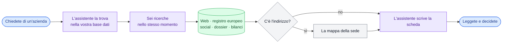
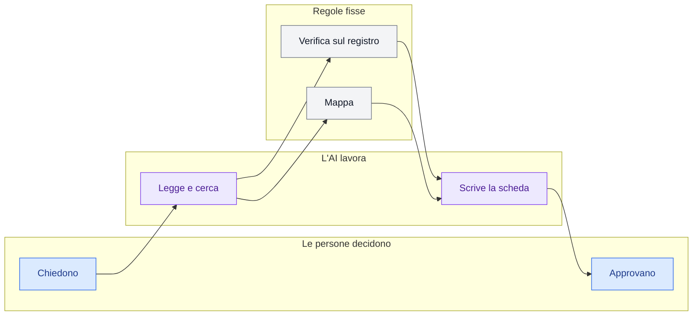
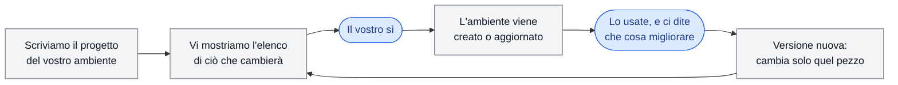
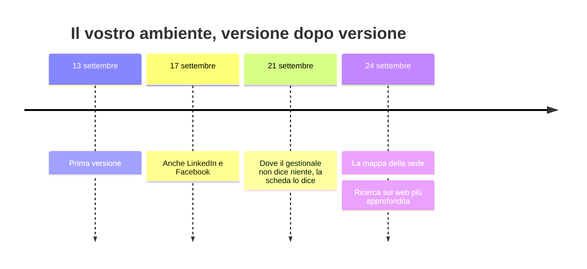

# I grafici della guida

Pochi, semplici, sempre gli stessi. Un disegno serve se il cliente lo capisce senza didascalia; se
ha bisogno di una legenda lunga, ha troppi elementi.

Tutti in **Mermaid**: nel Markdown si leggono come testo, nella pagina web diventano disegni. Si
scrivono in un blocco ` ```mermaid ` nel Markdown e in un `<pre class="mermaid">` nella pagina.

## I colori: sempre quattro, sempre con lo stesso significato

| Colore | Chi | `classDef` |
|---|---|---|
| azzurro | **una persona** (chi chiede, chi approva) | `persona` |
| viola | **l'AI** (un assistente che legge, cerca, scrive) | `ai` |
| verde | **un archivio o un servizio** (la base dati, il registro europeo, il web) | `fonte` |
| grigio | **una regola fissa** (se… allora…, la mappa, un controllo) | `regola` |

```
classDef persona fill:#dbeafe,stroke:#2563eb,color:#1e3a8a
classDef ai      fill:#ede9fe,stroke:#7c3aed,color:#4c1d95
classDef fonte   fill:#dcfce7,stroke:#16a34a,color:#14532d
classDef regola  fill:#f3f4f6,stroke:#6b7280,color:#111827
```

Sotto ogni disegno, una legenda di una riga: «azzurro: persone · viola: AI · verde: archivi e servizi · grigio: regole fisse».

## 1. Il flusso — al massimo otto riquadri

Da sinistra a destra, con i passi che il cliente riconosce. I sei rami paralleli diventano **un
riquadro solo** («sei ricerche, nello stesso momento») se il dettaglio non serve alla storia.



Il primo e l'ultimo riquadro sono **sempre una persona**: il disegno deve dire da solo che si
comincia e si finisce con qualcuno che decide.

## 2. Dove lavora l'AI — tre corsie

Quando la slide «chi fa che cosa» ha bisogno di un disegno invece delle tre colonne, tre gruppi affiancati con due o tre voci ciascuno:



## 3. Come nasce e come cambia l'ambiente — un ciclo

Per la slide del ciclo, nell'atto «Come è fatto». Il cliente vede che il suo sì sta **prima** di
ogni modifica, e che una correzione non riparte da zero:



Niente viola qui: il ciclo del progetto non lo fa l'AI.

## 4. Le versioni — una linea del tempo

Cinque o sei tappe scelte fra le versioni del manifest, ciascuna con **che cosa è cambiato per il
cliente** in parole semplici. Serve a mostrare che l'ambiente è migliorato molte volte senza
ripartire da zero. Il perché di una tappa è una cosa che il cliente ha chiesto o mostrato, mai una
prova fallita.



## Regole

- **Niente simboli BPMN**, niente nomi di passi del manifest, niente id.
- **Etichette di due-quattro parole**, con `<br/>` se serve andare a capo.
- **Un disegno per slide, e la slide non porta altro** che una riga di didascalia. L'atto «Come è fatto» ne ha due, in due slide
  (il ciclo e le versioni). La guida non è un catalogo di diagrammi.
- **Nessun grafico dei risultati di collaudo**: niente torte, barre o percentuali di domande superate.
- **Verificare che si disegni**: un errore di sintassi Mermaid nella pagina web mostra il codice al
  posto del disegno. Prima di pubblicare, aprire la copia HTML locale e guardarla.
